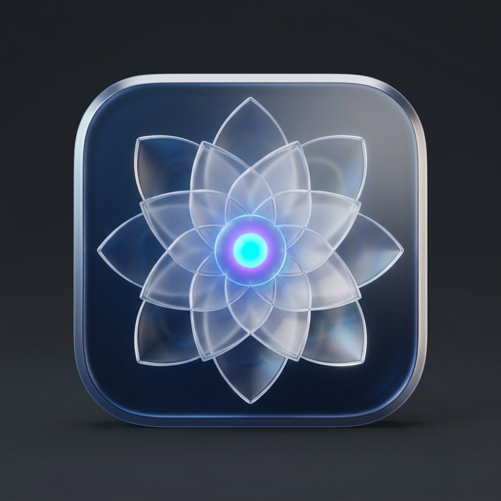
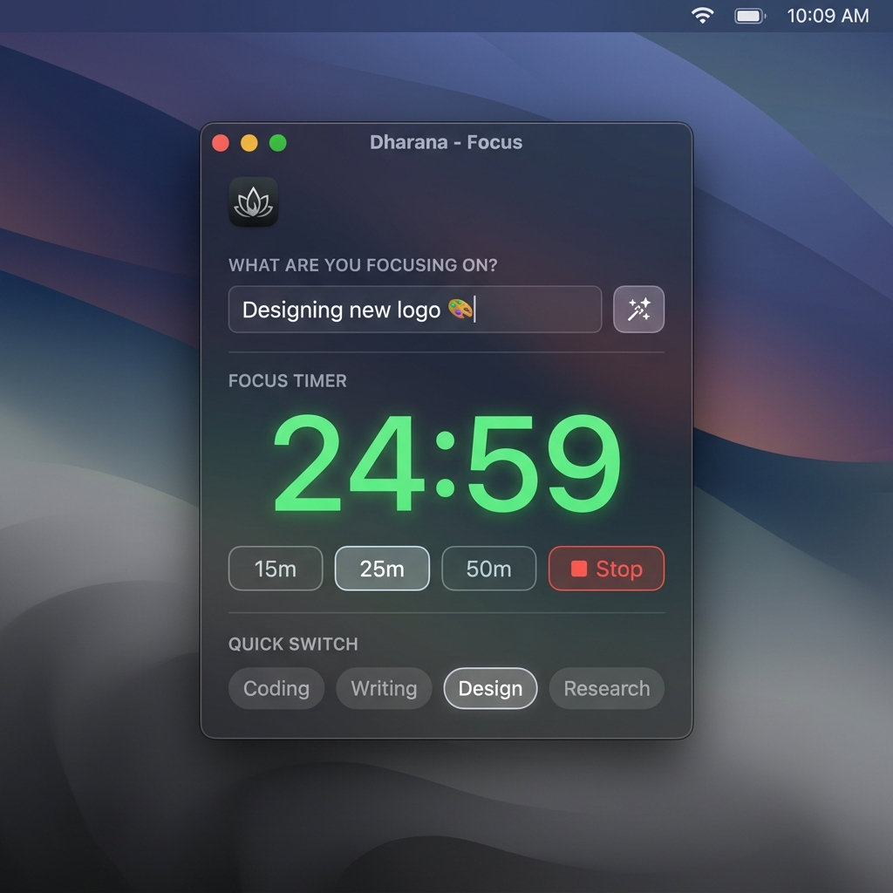
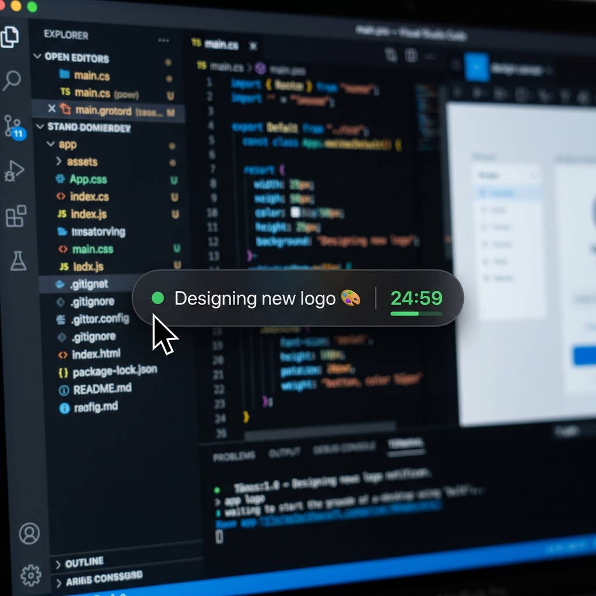

<p align="center">
  
</p>

<h1 align="center">Dharana (🧘 Focus Tracker)</h1>

<p align="center">
  <b>A lightweight, ultra-smooth macOS focus companion that keeps your active goal floating right beside your cursor.</b>
</p>

<p align="center">
  <a href="https://buymeacoffee.com/9o0rFmKygY">
    
  </a>
  
  
  
</p>

---

## 📸 Screenshots

<p align="center">
  
  &nbsp;&nbsp;
  
</p>

---

## ✨ Core Features

* **🧘 60 FPS Cursor Follower Pill**: Displays your active task and countdown in a semi-transparent dark pill that smoothly trails your mouse cursor across all macOS Spaces.
* **⌨️ Smart Typing Auto-Hide**: Automatically vanishes the moment you type in VS Code, Xcode, Safari, Terminal, or Slack so it **never** obstructs your code or text. Fades back in seamlessly when you move your mouse.
* **⏳ Inactivity Idle Fade-Out**: Fades to zero opacity when the cursor is stationary for 3 seconds, keeping your screen clean and distraction-free while reading.
* **📐 Display Edge & Boundary Avoidance**: Dynamically flips position (left/right, above/below) when approaching screen edges to avoid cursor clipping.
* **⏱️ Pomodoro Focus Timer**: Quick preset buttons (`15m`, `25m`, `50m`) with live digital countdown display, macOS notifications, and sound alerts on session completion.
* **🧠 Google Gemini AI Integration**: Analyzes your active application context to auto-suggest concise, emoji-tagged focus milestones via `gemini-2.5-flash`.
* **🔒 Hardware-Backed Keychain Security**: Stores your Google Gemini API key securely in the macOS Keychain (`Security.framework`) with zero plain-text disk storage.
* **⚡ 0.0% CPU & Low-Power Idle Mode**: Uses adaptive event listeners and GPU-cached rendering to eliminate idle battery drain on Apple Silicon & Intel Macs.
* **🛡️ Non-Obtrusive Click-Through**: Built with `ignoresMouseEvents = true` so the overlay never intercepts mouse clicks, selections, or drag-and-drop actions underneath it.

---

## 🚀 Quick Download & Installation

### Option 1: Download Pre-built Installer (Recommended)
Download the latest pre-packaged **`.dmg`** or **`.zip`** installer from the **[Releases](https://github.com/jayaprakashnarayana/dharana/releases)** tab.

1. Open **`Dharana-Installer.dmg`**.
2. Drag **Dharana.app** into your **Applications** folder.
3. Launch Dharana from Spotlight (`Cmd + Space > Dharana`) or your Applications folder.

*(Note: On first open outside the Mac App Store, if prompted by macOS Gatekeeper, simply **Right-Click > Open**, then click **Open**).*

---

## 🛠️ Building From Source

### 1. Build & Run Locally
```bash
# Clone the repository
git clone https://github.com/jayaprakashnarayana/dharana.git
cd dharana

# Compile and launch
swiftc -sdk $(xcrun --show-sdk-path --sdk macosx) -O main.swift -o Dharana
cp Dharana Dharana.app/Contents/MacOS/Dharana
open Dharana.app
```

### 2. Generate `.dmg` and `.zip` Distributables
To build standalone release installers:
```bash
chmod +x build_dmg.sh
./build_dmg.sh
```
Installers will be generated in `dist/`:
* 💿 **`dist/Dharana-Installer.dmg`**
* 📦 **`dist/Dharana-macOS.zip`**

---

## 🎯 Usage Guide

1. **Set Focus**: Click the Dharana Dock icon or Menu Bar item (`⚡️ DHARANA`), type your active task under **`WHAT ARE YOU FOCUSING ON?`**, and press **Enter**.
2. **Start Pomodoro**: Click `15m`, `25m`, or `50m` to begin a timed focus sprint.
3. **AI Suggestion**: Click the **Sparkles (✨)** button to have Gemini AI auto-detect what you're working on and title your session.
4. **Settings & Customization**: Click the **Gear (⚙️)** icon to customize typing auto-hide, idle delay, pill opacity, or configure your Gemini API Key.

---

## ☕️ Support & Sponsorship

If Dharana helps you stay in the flow and boost your daily productivity, consider supporting its development:

<p align="center">
  <a href="https://buymeacoffee.com/9o0rFmKygY">
    
  </a>
</p>

<p align="center">
  <b>Support via Buy Me a Coffee:</b> <a href="https://buymeacoffee.com/9o0rFmKygY">buymeacoffee.com/9o0rFmKygY</a>
</p>

---

## 📄 License
This project is open-source under the [MIT License](LICENSE).
